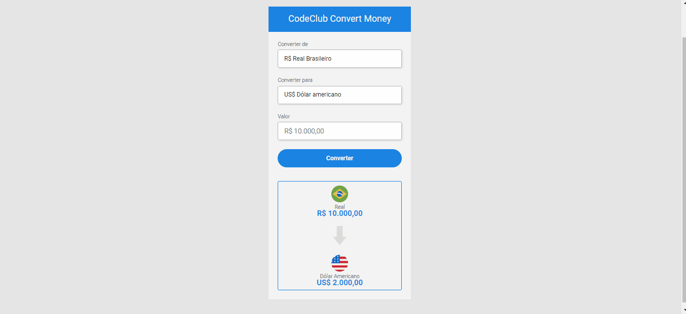

<h1 align="center">Convert Money </h1>

> ## 💻 About the project

Convert Money is a simple currency converter. In it you can convert from Real to US Dollar, Euro and Bitcoin.

> ## Project link
[https://wizardly-wright-a9fde6.netlify.app/](https://wizardly-wright-a9fde6.netlify.app/)

> ## 📸 Demo

 

> ## 🚀 Technologie
* [HTML](https://developer.mozilla.org/pt-BR/docs/Web/HTML)
* [CSS](https://developer.mozilla.org/pt-BR/docs/Web/CSS)
* [JAVASCRIPT](https://developer.mozilla.org/pt-BR/docs/Web/JavaScript)

>  ## 📝 Licença
Esse projeto está sob a licença MIT. Veja o arquivo [LICENSE](https://github.com/W-Carlos/ConvertMoney/blob/master/LICENSE) para mais detalhes.

